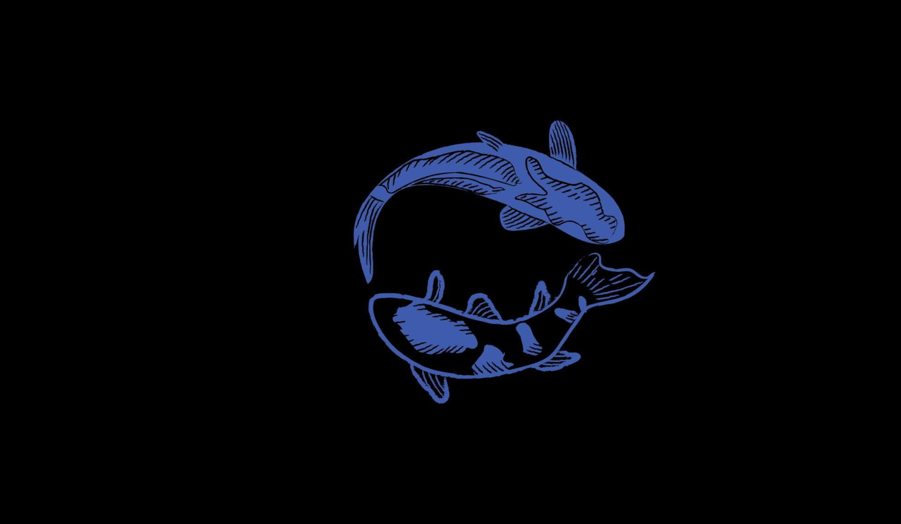

<h2> Ohayo!! 👋 </h2>

Right now you are on my ship and you have permission to be there without causing too much riot or trouble... 
You can call me by Baozi or better known as Bao... 

If you come to claim something, well, I apologize in advance...

I can talk in English > Español > Chinese ( Lowly )

<h2> 🧰 I'm Currently working on </h2>

No were... just keep destroying my programms... I really like do this, find BUGs and kill the BUG !!! 
All this for? That satisfaction of... RESOLUTION: NOT A BUG
I am not sure If I like it... 
I mean... definitly I can find a bug... for sure... even if there is no BUG... 
there is always a way to break something... 
Just give me time... 
I will be in your dreams... (I don't like where this is going)

<h2> 📖 Studies </h2>

For now I would say nothing... yeah nothing... 
I have knowledge about back and front, but I don't consider myself sufficiently qualified.

Maybe I'm underestimating myself... but: 
- I like pentesting ( Preparing as a hobby for the OSCP... sounds fun right?... )
- And programming ( Back-End { Java... } , Front-End { html, css, JS } ( I hate Back... <i>screaming</i> ) ).

BUT... this is my rutine programming:
- STEP 1: Make a program / feature / add something
- STEP 2: TEST
    - IF GOOD -> TRY TO BREAK IT UNTIL I FOUND A BUG ( My favorite part )
      - IF NOT FOUND A BUG -> STEP 5:
- STEP 3: FIX
- STEP 4: Return to STEP 2
- STEP 5: Well... I think I finish 
- STEP 6: break;
- STEP 7: Return to STEP 1:

Basically is all... I would add... I like cook Food 👨‍🍳 and the Japanese Culture... that means Otaku thinks too :3

<h3> Thanks for Read </h3>

I am still updating this until I just die.

<!-- Is this an comment in GitHub? But... markdown or what? nvm... looks all in one... noice -->
<!--
**TheLastBaozi/TheLastBaozi** is a ✨ _special_ ✨ repository because its `README.md` (this file) appears on your GitHub profile.

Here are some ideas to get you started:

- 🔭 I’m currently working on ...
- 🌱 I’m currently learning ...
- 👯 I’m looking to collaborate on ...
- 🤔 I’m looking for help with ...
- 💬 Ask me about ...
- 📫 How to reach me: ...
- 😄 Pronouns: ...
- ⚡ Fun fact: ...
-->
